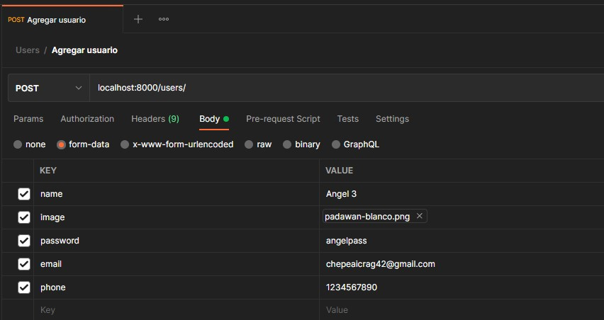
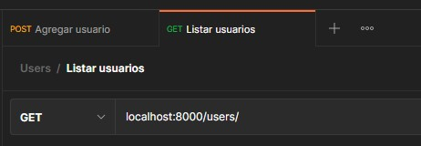
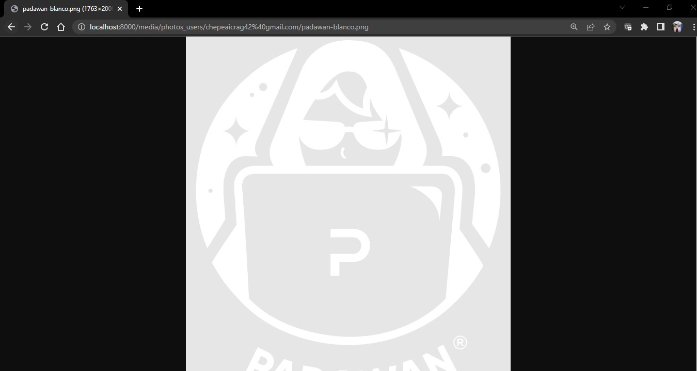

# Django-DRF-Example-Upload-Image
API RESTful sencilla para demostrar cómo trabajar con campos ImageField en Django y con imágenes almacenadas de forma local.
## Ejecución

1. Clona este repositorio
   ```bash
   git clone git@github.com:ChepeAicrag/Django-DRF-Example-Upload-Image.git
   ```
2. Crea un entorno virtual
   ```bash
   python -m venv env
   ```
3. Activa el entorno virutal
   * En Windows
   ```bash
   .\env\Script\activate
   ```
   * En Linux o Mac

   ```bash
   source ./env/Scripts/activate
   ```
 
4. Instala las dependencias en tu entorno virtual

   ```bash
   pip install -r requirements.txt
   ```

5. Ejecuta el servidor
   ```bash
   python manage.py runserver
   ```


6. Ejecuta las migraciones   
   ```bash
   python manage.py migrate
   ```

## Prueba

1. En postman, vamos a usar en Body el formato de form-data. Así cómo se muestra en la imagen.
   
2. El response de la petición anterior es:
   ```json
   {
      "id": 6,
      "last_login": null,
      "name": "Angel 3",
      "email": "chepeaicrag42@gmail.com",
      "phone": "1234567890",
      "image": "/media/photos_users/chepeaicrag42%40gmail.com/padawan-blanco.png",
      "is_superuser": false,
      "is_active": false,
      "is_staff": false,
      "date_joined": "2022-05-25T07:55:41.713136Z",
      "status_delete": false,
      "groups": []
   }
   ```
3. Y ahora para listar los usuarios. Vamos al otro endpoint haciendo un GET.
   
   


4. El response de la petición anterior es el. siguiente.
   ```json
   [
      {
         "id": 5,
         "last_login": null,
         "name": "Angel",
         "email": "chepeaicrag12@gmail.com",
         "phone": "1234567890",
         "image": "/media/photos_users/chepeaicrag12%40gmail.com/padawan-blanco.png",
         "date_joined": "2022-05-25T04:34:09.547891Z"
      },
      {
         "id": 6,
         "last_login": null,
         "name": "Angel 3",
         "email": "chepeaicrag42@gmail.com",
         "phone": "1234567890",
         "image": "/media/photos_users/chepeaicrag42%40gmail.com/padawan-blanco.png",
         "date_joined": "2022-05-25T07:55:41.713136Z"
      }
   ]
   ```
5. Para ver las imagenes, vamos a probar la última. 
   
   